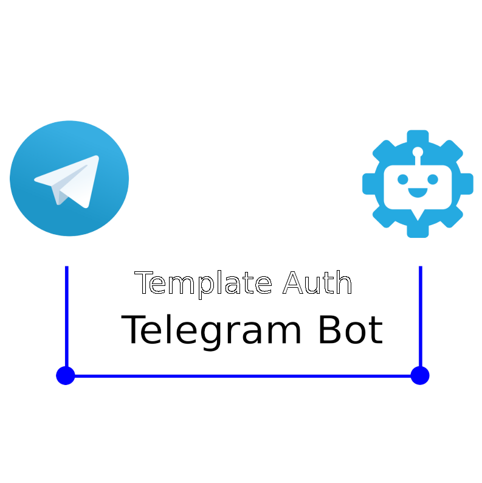

<p align="center">
  <a href="https://github.com/SergeyIvanovDevelop/Template-Auth-Telegram-Bot">
    
  </a>
</p>
<h1 align="center">
  Template-Auth-Telegram-Bot
</h1>

## Template-Auth-Telegram-Bot &middot; [](./LICENSE) [](https://www.python.org/) [](https://www.linkedin.com/in/sergey-ivanov-33413823a/) [](https://t.me/SergeyIvanov_dev) ##

This repository contains the code for a scalable telegram bot template that provides for user authentication.

## :computer: Getting Started  ##

**Step 1**

1. Go to home directory and clone repository from github: `cd ~ && git clone https://SergeyIvanovDevelop@github.com/SergeyIvanovDevelop/Template-Auth-Telegram-Bot`

**Step 2**<br>

2. Go to the directory of the downloaded repository: `cd ~/Template-Auth-Telegram-Bot`

**Step 3**<br>

3. Installing dependencies:

```
pip3 install -r ./requirements.txt
```

**Step 4**<br>

4. Get a token for your bot on the site `https://romua1d.ru/kak-poluchit-token-bota-telegram-api/` and put it in [bot.py](./bot.py):

```
	- token='<yout_telegram_bot_token>'
```

**Step 5**<br>

5. Run application: `python3 bot.py`


**:clapper: Example using (GIF):**<br>

This animation demonstrates scenarios for using the Template-Auth-Telegram-Bot.<br>

<p align="center">
  
</p>

### :bookmark_tabs: Licence ###
Template-Auth-Telegram-Bot is [CC BY-NC-SA 3.0 licensed](./LICENSE).
